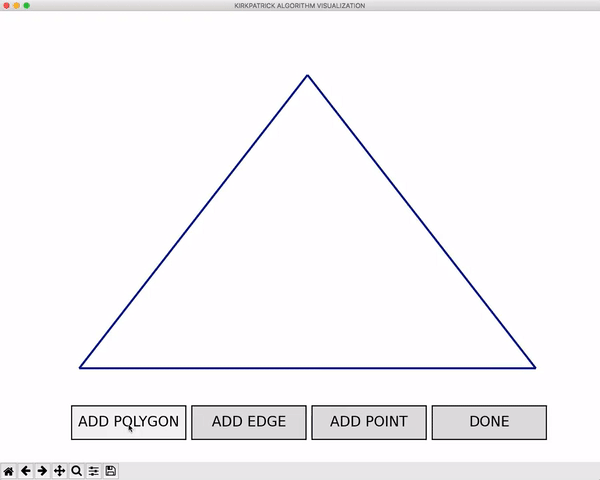
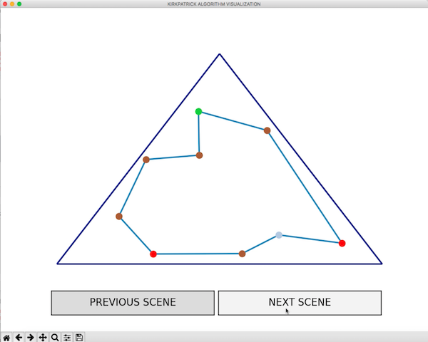
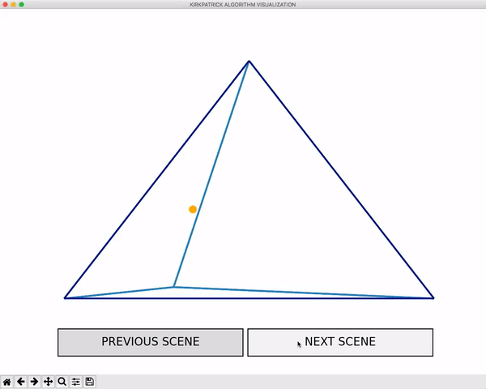
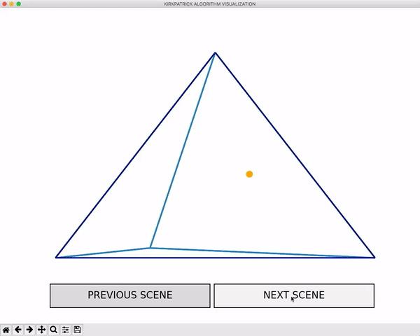

# Point location visualizer

Kirkpatrick's Algorithm visualizer for log(n) point location in a given planar subdivision based on triangulation refinement.

## Kirkpatrick's algorithm description

Kirkpatrick's algorithm for point location is also termed triangulation refinement method. It consists of triangulating 
newly created polygon (by currently the lowest degree vertex deletion) till we delete all the vertices. Given subdivision
(set of polygons) is enclosed by a triangle. We create a triangulation tree where the root is the triangle that encloses
a given subdivision. Each node's children are overlapping triangles of the previous triangulation. The leaves of the tree
are triangles composing initial triangulation. This way, we can easily locate given points in log(n) time complexity.

## Installation
This program uses the following python modules:

* Matplotlib
```
pip install matplotlib
```

* NumPy
```
pip install numpy
```

Clone this repository:

```
git clone https://github.com/michall-m/kirkpatrick-visualizer.git
```

## Running visualizer

### Executing program

```
python main.py <polygon_name>
```


<br />

### Drawing
The initial state is set by drawing a polygon, dividing it with edges and adding points to locate.

<p align="center">
  
</p>

<br />

### Vertex types
There are 5 types of vertices in various colors:


 
 **start** -   both neighbours are below and interior angle is less than π,


 **end** -     both neighbours are above and interior angle is less than π,


 **merge** -   both neighbours are above and interior angle is greater than π,


 **split** -   both neighbours are below and interior angle is greater than π,

 
 **regular** - otherwise


<p align="center">
  
</p>

<br />


### Kirkpatrick's triangulation refinement method

Vertex selected to be deleted is marked as <span style="color:red;">red</span>, as well as all the triangles containing it.
After its deletion, newly created subdivision is retriangulated and those triangles are marked as
<span style="color:green;">green</span>.


<p align="center">
  
</p>


<br />

### Point locating
Yellow indicates the triangle currently being processed, if it is correct it turns green.

<p align="center">
  
</p>


<p align="center">
  
</p>


<br />

## Acknowledgments

* [Kirkpatrick's point location](http://cgm.cs.mcgill.ca/~athens/cs507/Projects/2002/PaulSandulescu/)


