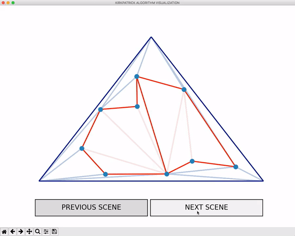

### **3. Lokalizacja punktu w przestrzeni dwuwymiarowej – metoda doskonalenia triangulacji – algorytm Kirkpatrick’a**

Dany jest obszar z podziałem poligonowym. Zadawany jest punkt P na płaszczyźnie. Należy zaimplementować algorytm Kirkpatrick’a lokalizacji punktu, który odpowie na pytanie, w którym elemencie znajduje się dany punkt. Zrobić analizę efektywności algorytmu. Program powinien w sposób graficzny prezentować etapy algorytmu dla wybranych przykładów ( w celu objaśnienia działania algorytmu). Program ma służyć jako narzędzie dydaktyczne do objaśnienia działania algorytmu.

Zbiór w tester.py:

![] test_data.png

